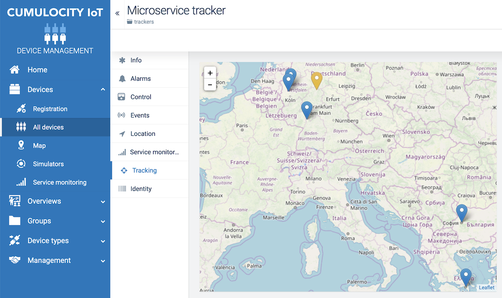

## Cumulocity Microservice

Microservice developed using Java 12, Spring Boot 2 and Docker.
It creates a warning alarm message (for demonstration purposes) and it exposes endpoints to:

*    Verify if the microservice is up and running.
*    Pass a parameter to the platform and return a formatted string.
*    Get some of the environment variables and the microservice service settings.
*    Track a user's approximate location and store it in the platform.
*    Get the tracked IPs and locations.

It also uses the Cumulocity UI to display the tracked locations on a map.

### Prerequisites

*    Cumulocity credentials (tenant, user and password). Create a free trial at the [Cumulocity IoT](https://cumulocity.com/) website.
*    Docker local installation.
*    A managed object (device ID) in Cumulocity.
*    A key from [ipstack](https://ipstack.com).

### Setup

Set the device ID and ipstack key in the manifest file (_cumulocity.json_). 
For more details, review the full tutorial of the [Java microservice](https://cumulocity.com/guides/microservice-sdk/http/#microservice-java) in the online guides.

### Build and deploy

Use the command `mvn clean install` to create a packed Docker microservice as a ZIP file and upload it to the Cumulocity platform. For more details about uploading a microservice ZIP file, refer to [Managing applications > Adding own applications](/guides/users-guide/administration#adding-applications) under the Administration section in the User guide.

### Execution

A GET request on <kbd>location/track</kbd> will obtain the client's IP from the request header and use the `createLocationUpdateEvent` method to get the approximate location.

In the Device Management application, navigate to **Devices** > **All devices** and locate the microservice tracker. A map with all locations can be seen under **Tracking**.

